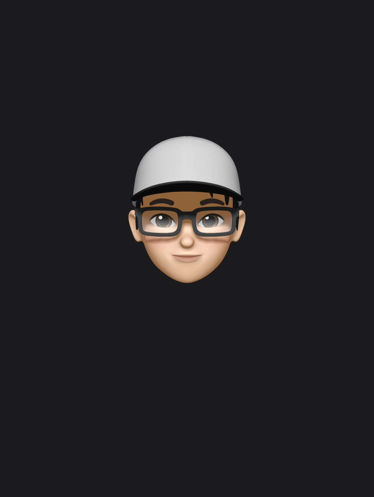

  
   
  
  
<code style="color: #84868c; background: transparent; font-size: 13px;">hey there ✦</code>

  
  <h1 style="font-size: 40px; font-weight: 700; margin-bottom: 15px;">Sajal Monga.</h1>

  

    <b>Sophomore</b> pursuing CSE with a specialization in <b>Cloud Computing</b>.  Building things, breaking things, figuring it out.
  

  

  

    <a href="https://www.linkedin.com/in/sajal-monga-40a2742b4/" style="color: #84868c; text-decoration: none; margin-right: 15px;">LinkedIn</a> • 
    <a href="mailto:sajal1105@gmail.com" style="color: #84868c; text-decoration: none; margin-left: 15px;">Email</a>
  

